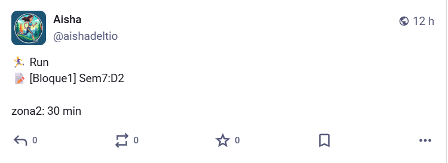
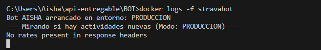

# **PROYECTO 1: Strava Auto-Publisher Bot 🏃‍♀️🚴‍♀️**

**Project title and description**

Strava-Mastodon Worker Bot. Este proyecto consiste en un "Worker" (servicio de fondo) automatizado que actúa como puente entre Strava y la red social Mastodon. Su función principal es monitorizar las actividades deportivas del y publicarlas de manera autónoma sin necesidad de intervención manual, manteniendo un historial para evitar contenido duplicado.

**Features you implemented**

- Monitoreo en Tiempo Real: Revisión cíclica (cada 3 horas) de la API de Strava para detectar nuevos entrenamientos.
- Sistema de Deduplicación: Uso de un archivo history.json para rastrear IDs de actividades ya publicadas.
- Mapeo de Emojis Dinámico: Identificación del tipo de deporte (Run, Ride, Swim, Hike, etc.) para asignar el emoji correspondiente automáticamente.
- Dual Mode (Entornos): Implementación de un modo DESARROLLO para pruebas locales (logs) y un modo PRODUCCION para envíos reales a la API.
- Validación de Payload: Comprobación de longitud y contenido del mensaje antes del envío para cumplir con los estándares de Mastodon.
- Gestión de Errores Robusta: Manejo de errores de red y límites de tasa (*Rate Limits*) de las APIs externas.

**Technologies used**

- Language: Python 3.9.
- Libraries: \* stravalib: Para la comunicación con Strava API v3.
  - mastodon.py: Para interactuar con la red social Mastodon.
  - json, os, time: Librerías estándar para lógica de persistencia y control de tiempos.
- Infrastructure: Docker y Docker Compose para asegurar la portabilidad.

**Prerequisites**

- Docker Desktop (recomendado para no tener que instalar Python localmente).
- Cuenta de desarrollador en Strava (Client ID y Client Secret).
- Cuenta en una instancia de Mastodon (Token de acceso).

**Installation steps**

- Descargar el proyecto: Localiza la carpeta BOT en tu equipo.
- Preparar credenciales: Asegúrate de tener listos tus tokens de acceso de Strava y Mastodon.
- Lanzar el contenedor:
   1. Abre una terminal (PowerShell o CMD) en la ruta de la carpeta BOT.
   2. Ejecuta el comando:
        docker compose up -d --build
- Verificar ejecución: El bot se quedará funcionando en segundo plano.

- Configuration instructions (.env) :Dentro de la carpeta BOT, debes crear un archivo llamado .env. Este archivo no debe compartirse. Debe contener:

                                    ID\_CLIENTE=tu\_id\_de\_strava
                                    SECRETO\_CLIENTE=tu\_secreto\_de\_strava
                                    S\_TOKEN\_ACTUALIZACION=tu\_refresh\_token
                                    M\_TOKEN\_ACCESO=tu\_token\_de\_mastodon
                                    MASTODON\_API=https://tu-instancia.social
                                    ENTORNO=PRODUCCION

**Usage examples**

- Para ver qué está haciendo el bot en este momento:

docker logs -f stravabot

- Para detener el bot:

docker compose down

**Screenshots or GIFs**

**Course concepts applied**

- Consumo de APIs de Terceros: Aplicación práctica de autenticación OAuth2 y refresco de tokens.
- Contenerización con Docker: Aislamiento del entorno para evitar el problema de "en mi máquina funciona".
- Variables de Entorno: Gestión segura de secretos y configuración de software.
- Lógica de Persistencia Simple: Almacenamiento local mediante archivos JSON para mantener el estado de la aplicación.

**API limitations**

- Strava Rate Limits: La API gratuita limita el número de peticiones. El bot mitiga esto espaciando las revisiones cada 3 horas.
- Mastodon Character Limit: Los mensajes están limitados a 500 caracteres. El bot incluye una función de validación para evitar fallos de publicación si la descripción de Strava es muy larga.

**Known issues or limitations**

- Si se borra el contenedor y el volumen asociado, el archivo history.json se pierde y el bot podría republicar actividades antiguas (se soluciona usando volúmenes de Docker).
- El bot requiere un *Refresh Token* inicial generado manualmente para empezar a trabajar.

**Future improvements**

- Thread Helper: Implementar la división automática de posts largos en hilos (threads).
- Soporte Multimedia: Añadir la capacidad de descargar la imagen del mapa del entrenamiento y adjuntarla al post.

