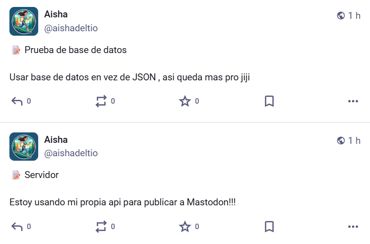
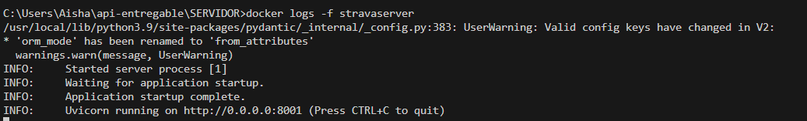
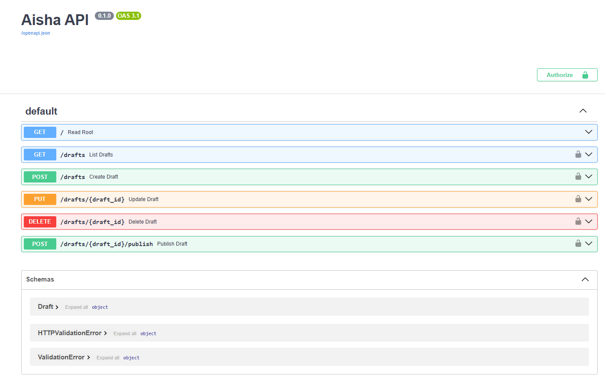

# **PROYECTO 2: API Wrapper & Management Server 🛠️**

**Project title and description**

StravaBot Management API (Backend). Este proyecto es un servidor de backend desarrollado con FastAPI que actúa como un "API Wrapper" personalizado. Permite gestionar borradores de sus entrenamientos de forma manual antes de publicarlos, ofreciendo una capa de control, persistencia en base de datos relacional y seguridad.

**Features you implemented**

- Gestión Integral de Borradores (CRUD): Capacidad para Crear, Leer, Actualizar y Eliminar (Create, Read, Update, Delete) publicaciones desde una interfaz unificada.
- Persistencia con Base de Datos SQL: Migración de archivos JSON a una base de datos SQLite utilizando el ORM SQLAlchemy para una gestión de datos profesional.
- Seguridad de Acceso (Basic Auth): Implementación de una capa de autenticación para proteger todos los endpoints sensibles, utilizando comparación segura de credenciales con la librería secrets.
- Paginación de Datos:Sistema de consulta eficiente mediante parámetros skip y limit para manejar grandes volúmenes de registros sin saturar la red.
- Documentación Automatizada: Generación automática de documentación técnica interactiva a través de Swagger UI.
- Publicación Selectiva: Endpoint especializado para enviar borradores específicos a Mastodon una vez que el usuario ha revisado el contenido.

**Technologies used**

- Framework Principal: FastAPI (Python).
- ORM / Base de Datos: SQLAlchemy y SQLite.
- Servidor ASGI: Uvicorn.
- Seguridad: HTTPBasic y Pydantic para validación de esquemas.
- Contenerización: Docker y Docker Compose.

**Prerequisites**

- Docker Desktop.
- Navegador web para acceder a la documentación interactiva.

**Installation steps**

- Navegar a la carpeta: Entra en el directorio SERVIDOR.
- Configurar credenciales: Verifica que el archivo .env tenga las claves necesarias (ver siguiente sección).
- Desplegar con Docker:
   1. Abre la terminal en la carpeta SERVIDOR.
   2. Ejecuta: docker compose up -d --build

-Acceso: Abre tu navegador en http://localhost:8001/docs
- Configuration instructions (.env): El servidor utiliza un puerto diferente (8001) para no entrar en conflicto con otros servicios. En el archivo .env se deben configurar las credenciales de administración:

                                    API\_USER=admin
                                    API\_PASS=tu\_contraseña\_segura
                                    M\_TOKEN\_ACCESO=token\_de\_tu\_bot\_mastodon
                                    MASTODON\_API=https://tu-instancia.social

**Usage examples**

Una vez dentro de Swagger UI (/docs):

1. Autorización: Haz clic en el botón "Authorize" e introduce tus credenciales del .env.
2. Crear un Borrador: Usa POST /drafts para guardar un entrenamiento (Ej: "Carrera por el río", "10km a ritmo suave").
3. Listar: Usa GET /drafts para ver tus publicaciones guardadas y sus IDs.
4. Publicar: Usa POST /drafts/{id}/publish para enviar ese contenido específico a Mastodon. El estado cambiará automáticamente a published.

**Screenshots or GIFs**

**Course concepts applied**

- Modelado de Datos Relacionales: Diseño de tablas con tipos de datos específicos (Integer, String, BigInteger) y claves primarias.
- Arquitectura de Software: Separación de responsabilidades entre el modelo de datos (SQLAlchemy) y el modelo de intercambio (Pydantic).
- Inyección de Dependencias: Uso de Depends en FastAPI para gestionar sesiones de base de datos y seguridad de forma limpia.
- Manejo de Códigos de Estado HTTP: Implementación de respuestas precisas como 201 Created, 401 Unauthorized y 404 Not Found.

**API limitations**

- Single-thread SQLite: Debido a que SQLite es una base de datos basada en un archivo, está optimizada para un solo usuario a la vez, lo cual encaja perfectamente con este uso personal.
- Auth Estática: El sistema utiliza Basic Auth, que es ideal para herramientas internas, aunque para sistemas públicos masivos se recomendaría JWT.

**Known issues or limitations**

- Si se borra el volumen de Docker sin hacer copia del archivo .db, se pierden los borradores.

**Future improvements**

- Generación de API Keys: Permitir que otros servicios se conecten mediante tokens únicos en lugar de usuario/contraseña.
- Integración de Frontend: Desarrollar una interfaz visual en React para gestionar los borradores sin usar Swagger.
- Filtrado por Fecha: Añadir la capacidad de buscar borradores por rango de fechas en la base de datos.

